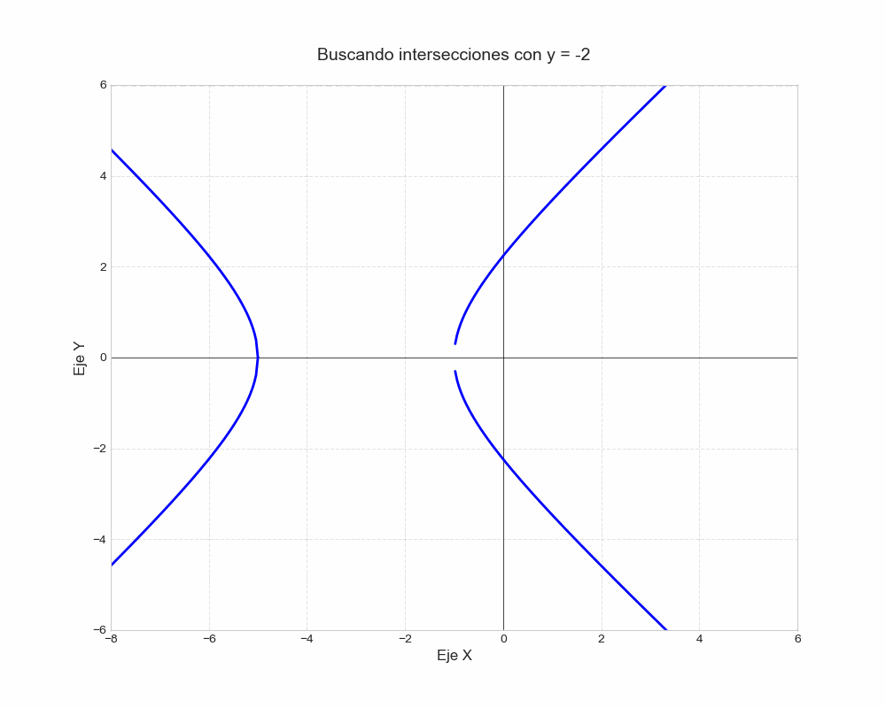
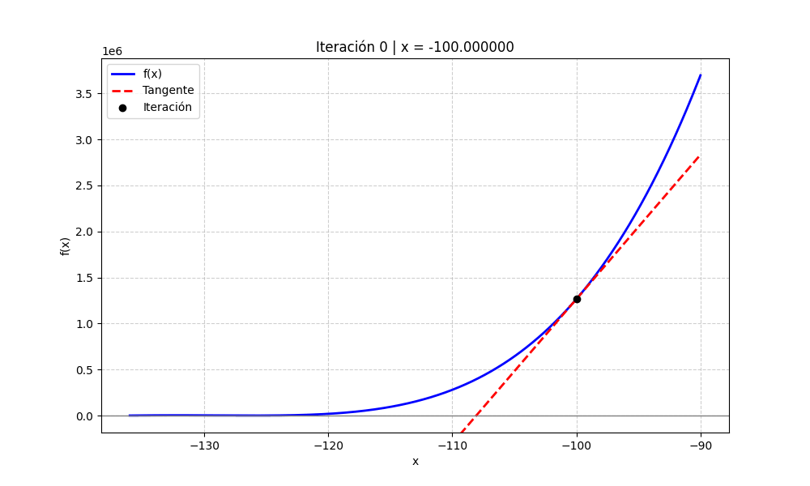

# Métodos Numéricos

Este repositorio reúne todos mis trabajos de métodos numéricos que anteriormente tenía en repositorios separados.

Cada carpeta contiene un README específico que explica su contenido detallado.