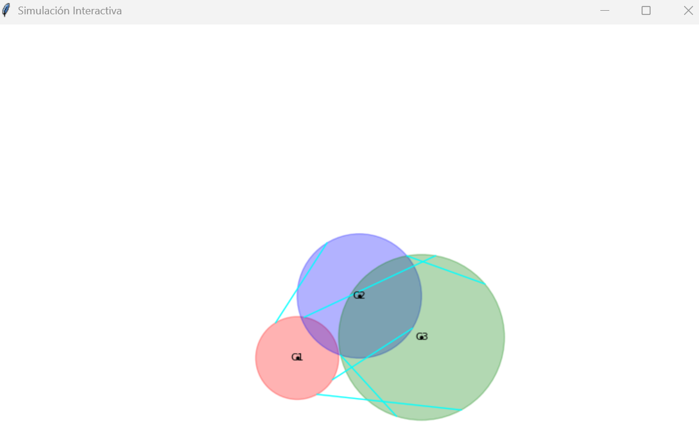
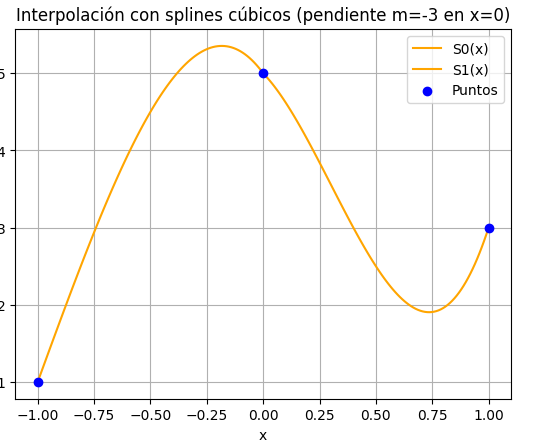
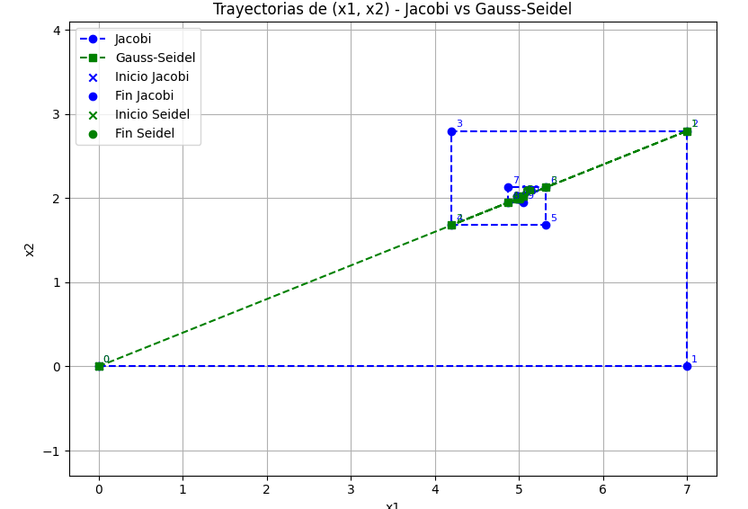
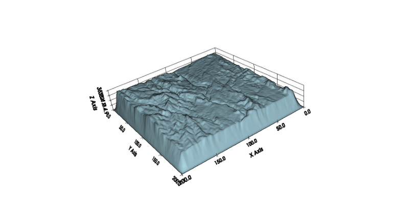

# Métodos Numéricos

Este repositorio reúne todos mis trabajos de métodos numéricos que anteriormente tenía en repositorios separados.

<table>
<tr>
<td></td>
<td></td>
</tr>
<tr>
<td></td>
<td></td>
</tr>
<tr>
<td></td>
<td></td>
</tr>
<tr>
<td></td>
<td></td>
</tr>
</table>

Cada carpeta contiene un README específico que explica su contenido detallado.